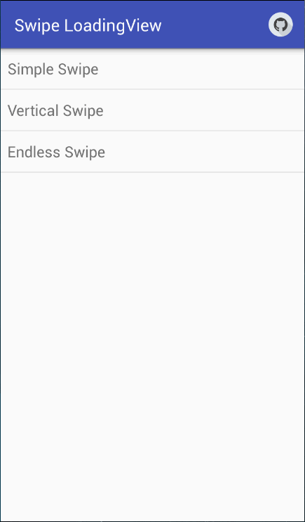

## Android SwipeLoadingView

### Introduction
SwipeLoadingView offers a LoadingView like drawer when you are swiping on it. You can use this widget when you want to switch something like video or picture.

### Feature & Todo

Feature
 - You can set listener of the swipe event.
 - You can customize the threshold of the swipe and the animation duration.
 - Multi swipe mode feature.

Todo
 - Fix bugs with TouchEvent manipulating.
 - Refract the classes for better extension.
 - Horizontal Swipe feature support.

### License
Copyright 2016 Kaede Akatsuki
 Licensed under the Apache License, Version 2.0 (the "License"); you may not use this file except in compliance with the License. You may obtain a copy of the License at 
http://www.apache.org/licenses/LICENSE-2.0
 Unless required by applicable law or agreed to in writing, software distributed under the License is distributed on an "AS IS" BASIS, WITHOUT WARRANTIES OR CONDITIONS OF ANY KIND, either express or implied. See the License for the specific language governing permissions and limitations under the License.
